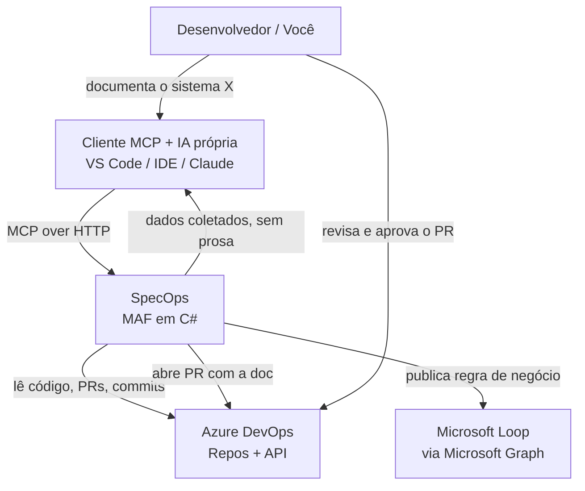

# Design de Solução: SpecOps (MCP de Documentação Automatizada)

> Documento de arquitetura para uma solução que **gera documentação automaticamente** a
> partir do que já existe (código, endpoints, histórico), deixando para a pessoa apenas
> revisar e aprovar. Objetivo: eliminar o custo de tempo que hoje impede a documentação
> de acontecer.

- **Autor:** madu
- **Data:** 2026-07-13
- **Status:** Proposta para discussão
- **Stack alvo:** .NET / C# · Microsoft Agent Framework (MAF) · Azure DevOps · Microsoft Loop
  (sem recurso de IA próprio — a geração de prosa fica a cargo do modelo do cliente
  MCP, ver seção 7)

---

## 0. Visão de negócio (resumo não técnico)

**O que é:** o SpecOps é um assistente que **escreve o primeiro rascunho da
documentação de um sistema automaticamente**, lendo o que já existe — o código, os
endpoints, o histórico de mudanças — em vez de exigir que alguém pare o que está
fazendo para escrever do zero. A pessoa só revisa e aprova o rascunho, como revisaria
o código de um colega.

**O problema que resolve:** hoje a documentação não existe não porque falte padrão
ou vontade, mas porque falta tempo — escrever documentação sempre perde pra entregar
a próxima funcionalidade. O efeito colateral é que o conhecimento do sistema fica só
na cabeça de poucas pessoas, o que é um risco real: se essas pessoas saem do time ou
da empresa, esse conhecimento vai embora com elas, e onboarding de gente nova fica
mais lento e mais caro.

**O objetivo:** derrubar o custo de documentar de "escrever do zero" para "revisar
algo que já chega 80% pronto". Não é sobre ter documentação por ter — é sobre tornar
a documentação barata o suficiente para que ela finalmente aconteça, de forma
sustentável, sem depender de força de vontade individual.

**Como isso é entregue com segurança:** o agente nunca publica nada sozinho. Ele só
gera um rascunho e abre para revisão humana — a decisão final sobre o que vira
documentação oficial continua sempre com uma pessoa. Isso elimina o risco de
documentação errada ser publicada sem ninguém perceber.

**Para quem isso importa:**

- **Times de desenvolvimento:** menos tempo perdido escrevendo doc do zero, sistemas
  críticos deixam de depender só da memória de quem os construiu.
- **Liderança técnica:** redução de risco operacional (fator ônibus) e um caminho
  concreto para elevar o padrão de documentação sem aumentar o orçamento de tempo do
  time.
- **Novas contratações:** onboarding mais rápido, com documentação que reflete o
  estado real do sistema em vez de ficar desatualizada.

O restante deste documento (seções 1 em diante) detalha a arquitetura técnica dessa
solução para quem for implementá-la ou avaliar a viabilidade técnica.

---

## 1. Problema

A documentação não existe não por falta de padrão, mas por falta de tempo: escrever à mão
compete com entregar features, e perde sempre. O conhecimento fica na cabeça das pessoas e
vira risco (fator ônibus).

**Objetivo:** reduzir o esforço humano de documentar de "escrever do zero" para "revisar um
rascunho pronto". Se o rascunho já vem 80% pronto a partir do código, o custo cai a ponto
de a documentação finalmente acontecer.

## 2. Princípio central: o agente rascunha, o humano aprova

Não automatizamos a *decisão*, automatizamos o *trabalho braçal*. O agente:

1. Lê o que já é fonte da verdade (código, endpoints, commits, PRs).
2. Gera o rascunho no padrão da empresa (os templates de README, ADR, arquitetura, runbook).
3. Abre para revisão humana — nada é publicado sem aprovação (human-in-the-loop).

Isso é seguro (ninguém publica doc errada sozinho) e é exatamente o padrão que o MAF
suporta nativamente com *tool approval workflows*.

## 3. Por que MCP + MAF (e não só uma skill)

Uma skill guia a *escrita*, mas não *lê o repositório* nem *escreve no Loop*. Este caso
exige ação sobre sistemas reais — por isso um servidor MCP. E o MAF é a escolha coerente
porque é Microsoft-nativo: fala com Azure DevOps e Loop sem sair do ecossistema Azure, o
que resolve governança e segurança de dados de antemão. A geração de texto/prosa não é
feita por um recurso de IA que o agente precisaria manter — fica a cargo do modelo que o
próprio cliente MCP já traz (Cursor, Claude, etc.).

Regra: **skill para padronizar a escrita; MCP/MAF para automatizar a coleta e a publicação.**
Os dois convivem — a skill pode até ser o "guia de estilo" que o agente carrega.

## 4. Arquitetura (visão de contexto)

Tudo dentro do tenant Azure da empresa. Nenhum dado de código trafega para fora. O
agente não chama nenhum recurso de IA por conta própria — só coleta e organiza dados;
quem redige a prosa é o modelo que o cliente MCP já traz.

## 5. As ferramentas que o MCP exporia

Cada ferramenta é um verbo objetivo. Comece com poucas e sólidas.

| Ferramenta MCP | O que faz | Fonte | Saída |
|---|---|---|---|
| `auditar_docs` | Varre um repo e lista o que está sem README/ADR/runbook | Azure DevOps | Relatório de lacunas |
| `gerar_readme` | Monta o README a partir da estrutura do projeto e do `.csproj` | Código .NET | Rascunho em PR |
| `analisar_arquitetura` | Infere o estilo arquitetural (Clean Architecture, MVC, Hexagonal) pelo grafo de `ProjectReference` entre `.csproj` e aponta violações de dependência entre camadas | Código .NET | Relatório de arquitetura |
| `gerar_api_docs` | Extrai endpoints de controllers/minimal APIs + comentários XML | Código .NET | Doc de API em PR |
| `rascunhar_adr` | Sugere ADRs a partir do histórico de commits/PRs relevantes | Git history | Rascunho de ADR |
| `gerar_diagrama` | Gera diagrama C4 (Mermaid) a partir de dependências do projeto | Código .NET | `.md` com Mermaid |
| `publicar_regra_no_loop` | Traduz uma regra técnica para linguagem de GP e publica | Spec + Graph API | Página no Loop |

> Detalhe .NET que facilita muito: se o time habilitar **geração de XML docs** e
> **comentários `///`**, o agente extrai a documentação de API quase pronta.

## 6. Fluxo de ponta a ponta (exemplo real)

1. Você roda `auditar_docs` no repositório do sistema crítico do piloto.
2. O agente devolve: "faltam README, 2 ADRs e o runbook de deploy".
3. Você roda `gerar_readme` e `gerar_diagrama` — o agente lê o código, devolve os dados
   coletados (a IA do seu cliente MCP redige a prosa) e **abre um Pull Request** no
   Azure DevOps com os rascunhos.
4. Você revisa o PR como revisaria código, ajusta o que for preciso, aprova e faz merge.
5. Para as regras de negócio, `publicar_regra_no_loop` cria a página no Loop em linguagem de GP.

O humano nunca sai do controle; só deixa de escrever da folha em branco.

## 7. Stack técnico

- **Servidor MCP:** projeto .NET (C#) usando o SDK MCP + Microsoft Agent Framework. O agente
  é convertido em ferramenta MCP e servido por HTTP (`.AsAIFunction()` → MCP tool).
- **Geração de prosa:** nenhuma — o servidor não embute nem paga recurso de IA
  próprio. As tools fazem só leitura e análise determinística do código; redigir a
  prosa/narrativa é responsabilidade do modelo que o cliente MCP já traz (Cursor,
  Claude, etc.).
- **Acesso ao código:** Azure DevOps REST API / client library (ler repos, abrir PRs).
- **Publicação no Loop:** Microsoft Graph API (Loop é construído sobre o Graph/Fluid).
- **Autenticação:** Entra ID (Azure AD) com managed identity — sem segredos no código.
- **Hospedagem:** Azure App Service ou Container Apps, dentro da rede corporativa.

> **Nota de implementação:** o `specops` (Python, ver `specops/README.md`) é a
> versão hoje implementada desse servidor e já segue essa decisão — sem "motor de IA"
> embutido. Isso evita o servidor precisar pagar/gerenciar credenciais de IA para
> servir terceiros, especialmente relevante no modo hospedado público (ver seção
> "Rodando como serviço público (HTTP)" no README do specops).

## 8. Rollout em fases (não construa tudo de uma vez)

**Fase 0 — Prova de conceito (1 ferramenta):** só `gerar_readme`, rodando local, contra um
repo. Objetivo: provar que o rascunho gerado é bom o bastante. Baixo custo, alta prova de valor.

**Fase 1 — Leitura + geração:** adicione `auditar_docs`, `gerar_api_docs`, `gerar_diagrama`.
Ainda sem publicar nada — só abre PR. Aqui já entrega valor real ao time.

**Fase 2 — Publicação e Loop:** `rascunhar_adr` e `publicar_regra_no_loop` via Graph. Aqui
fecha o ciclo técnico ↔ negócio.

**Fase 3 — Automação contínua:** um pipeline no Azure DevOps roda `auditar_docs`
semanalmente e abre PRs de doc automaticamente quando detecta lacuna.

## 9. Riscos e trade-offs (pensamento de arquiteto)

- **Qualidade do rascunho:** a IA (do cliente MCP) pode inventar. Mitigação: sempre via PR
  com revisão humana; nunca publicação direta. O agente sugere, não decide.
- **Custo de IA:** como o servidor não chama nenhum recurso de IA por conta própria, quem
  paga o custo de geração de prosa é sempre o cliente MCP (e a assinatura de IA que ele já
  tem) — o servidor não acumula custo de terceiros usando a ferramenta.
- **Manutenção do próprio agente:** é software de produção, precisa de dono. Mitigação:
  começar mínimo (1 ferramenta) e só crescer com uso comprovado.
- **Segurança de código-fonte:** o servidor só faz leitura/análise determinística — não
  envia código para nenhum recurso de IA de terceiros. No modo hospedado, o código é lido
  de um clone raso e descartado a cada chamada (ver `specops/README.md`).
- **Não vira desculpa para não pensar:** o agente documenta o "o quê" e o "como"; o "por quê"
  (decisões) ainda precisa de julgamento humano. Ele acelera, não substitui o arquiteto.

## 10. Como isso te posiciona

Escrever documentação te faz útil. **Construir a plataforma que faz a empresa inteira
documentar sozinha** te faz estratégico. Este projeto te move de "quem documenta" para "quem
projetou o sistema de documentação" — que é papel de arquiteto de soluções, exatamente o que
o teu curso trata. É um artefato concreto para levar à liderança como proposta de iniciativa.

## 11. Próximos passos sugeridos

1. Validar com o time se XML docs / comentários `///` estão (ou podem ser) habilitados nos projetos.
2. Confirmar permissões de acesso ao Azure DevOps (para as fases de auditoria/PR/Loop,
   quando entrarem em escopo — não é preciso recurso de IA próprio, ver seção 7).
3. Construir a Fase 0 (`gerar_readme`) contra o repo do piloto e medir a qualidade do rascunho.
4. Com o resultado em mãos, apresentar este design como proposta de iniciativa.